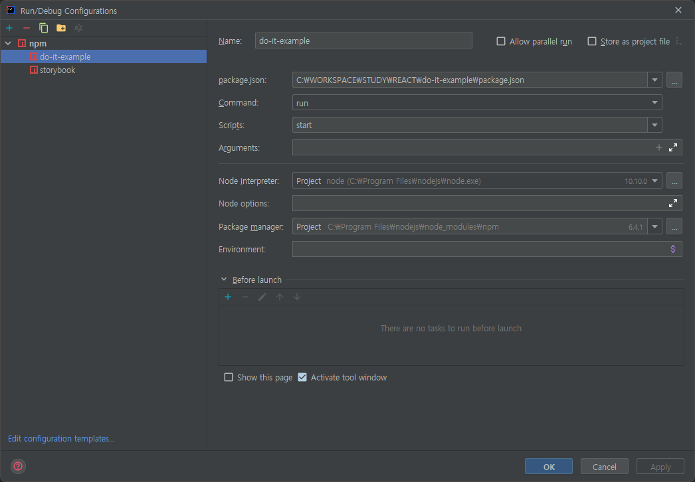
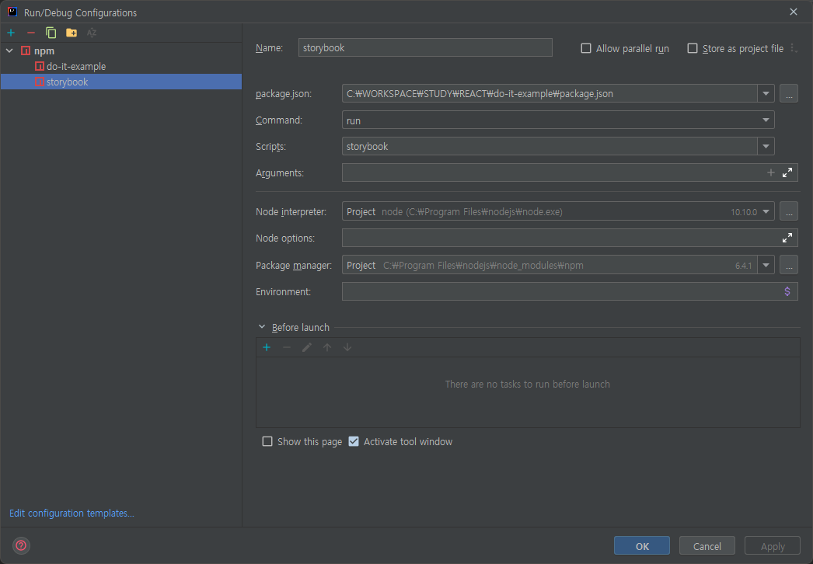

# Do it! 리액트 프로그래밍 정석

### NVM(노드 버전 매니저) 설치
nvm-windows download here: https://github.com/coreybutler/nvm-windows/releases/tag/1.1.7

### `nvm -v`
nvm으로 node 설치
### `nvm install 10.10.0`
node 설치 확인
### `nvm ls`
설치 node중 사용할 버전 선택
### `nvm use 10.10.0`
node 버전 확인
### `node -v`
npm 버전 확인
### `npm -v`

프로젝트 클론받은 경로에서 package.json 라이브러리 인스톨
### `npm i`

프로젝트 실행
### `npm start`

스토리북 실행
### `start-storybook -p 9001 -c .storybook`

